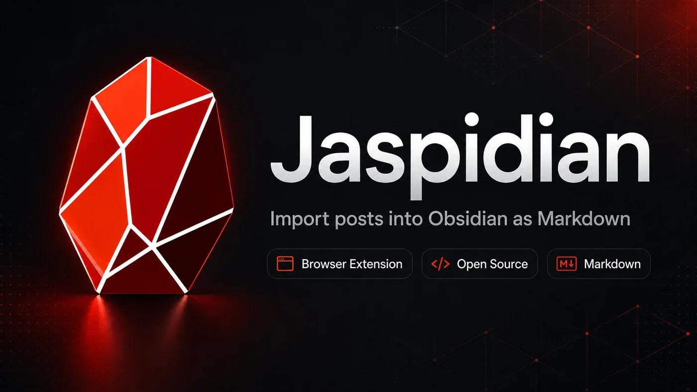

<p align="center">
  
</p>

# Jaspidian

Save Facebook posts you can see in your browser straight into your Obsidian vault as Markdown notes — with author, group context, comments, and images.

Jaspidian is a Chrome / Edge extension paired with an Obsidian plugin. It only ever touches content you are already viewing in your own logged-in Facebook session. It does not log in for you, does not bypass anything, and does not see any post you cannot see yourself.

---

> ## ⚠️ Personal use only
>
> Jaspidian is licensed under **PolyForm Noncommercial 1.0.0**. It may be used for personal, hobby, educational, research, and non-profit purposes. **Commercial use is not permitted.** See [LICENSE](LICENSE) and [DISCLAIMER.md](DISCLAIMER.md).
>
> Jaspidian is **not** affiliated with Meta, Facebook, or Obsidian. By installing, you accept full responsibility for complying with [Facebook's Terms of Service](https://www.facebook.com/terms.php) and the privacy laws in your jurisdiction. Read [DISCLAIMER.md](DISCLAIMER.md) before installing.

---

## How it works

| Piece | Where it runs | What it does |
|---|---|---|
| **Browser extension** | Chrome / Edge | Reads the visible Facebook page, builds the note |
| **Obsidian plugin** | Inside Obsidian | Listens on `127.0.0.1:37123` and writes the note to disk |

Both pieces are installed locally. They talk to each other on loopback only — nothing leaves your machine.

## What it does

- Detects posts on the current Facebook tab (feed, group, page, profile, permalink, photo view)
- Extracts author, group/page context, post body, images, link previews, and comments
- Saves an Obsidian-ready Markdown file with YAML frontmatter into your vault
- Downloads post images into a per-post attachments folder
- Filters comments to OP-only, OP-answered, or all
- Detects post language and applies right-to-left layout where needed (Hebrew, Arabic)

## Install

Distribution is **GitHub-only**. There is no Chrome Web Store listing.

1. Download the latest `jaspidian-full-vX.Y.Z.zip` from the [Releases page](https://github.com/panibor/jaspidian/releases/latest)
2. Follow [INSTALL.md](INSTALL.md) inside the zip

To build from source, see [Build from source](#build-from-source).

## Privacy at a glance

- No Facebook credentials are ever requested or stored
- No login automation, no private API use, no anti-bot bypass
- All capture happens on content you can already see in your own browser
- Extension ↔ plugin traffic is loopback (`127.0.0.1`) only
- No analytics, no telemetry, no Jaspidian update server, no built-in cloud calls

The Obsidian plugin includes an **optional, off-by-default "prettify with AI"** feature. If you turn it on and enter an OpenRouter API key (cloud) or an Ollama URL (typically local), the plugin sends note content to that provider when you save. Leave the feature off and no data leaves your machine. See [PRIVACY.md](PRIVACY.md) for the full statement.

## Build from source

Requires Node.js 20+.

```powershell
# Browser extension
npm install
npm run build
# → produces dist/  (load as an unpacked extension in chrome://extensions/)

# Obsidian plugin
cd obsidian-plugin
npm install
npm run build
# → produces obsidian-plugin/main.js
# Copy main.js + manifest.json into <vault>/.obsidian/plugins/jaspidian/
```

## Repo layout

```
public/manifest.json     Extension manifest (MV3)
public/assets/           Extension icons (16/32/48/128)
src/                     Extension source (TypeScript)
  background/            Service worker + message handlers
  content/               Page scanner, extractor, comment walker
  popup/                 Popup UI
  options/               Options page UI
  obsidian/              Markdown renderer + plugin HTTP client
  shared/                Types, constants, utilities
obsidian-plugin/         Obsidian plugin source + build
```

## Contributing

Issues and pull requests are welcome. See [CONTRIBUTING.md](CONTRIBUTING.md) for ground rules — including that contributions are accepted under the same PolyForm Noncommercial 1.0.0 licence as the rest of the project.

## License

PolyForm Noncommercial 1.0.0 — see [LICENSE](LICENSE).
